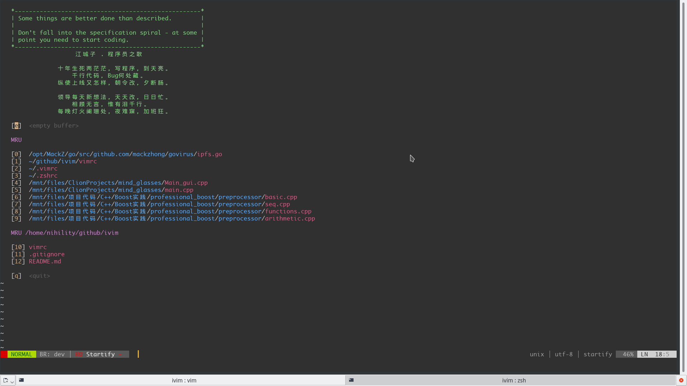
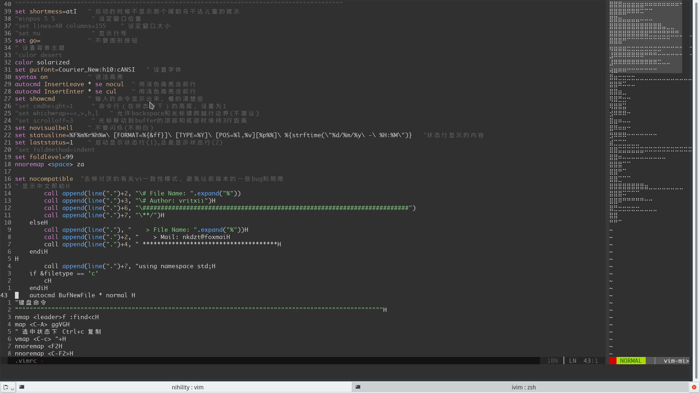
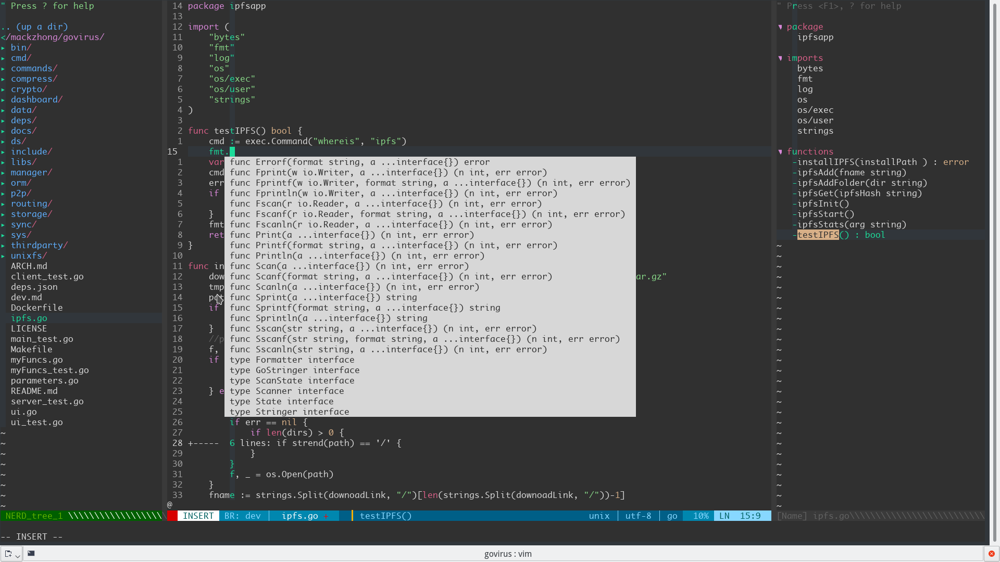
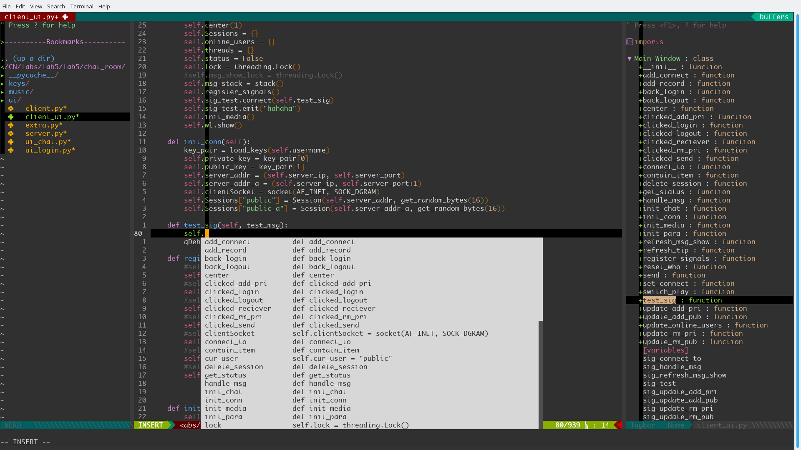
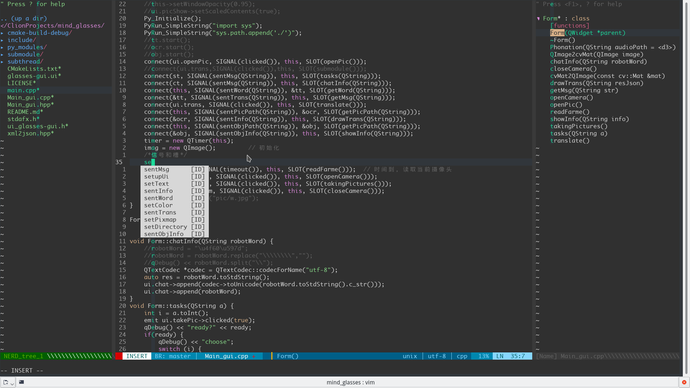
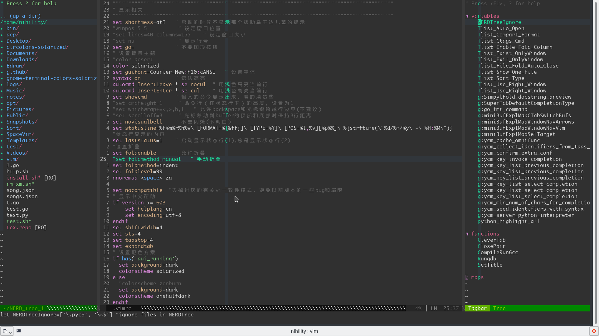
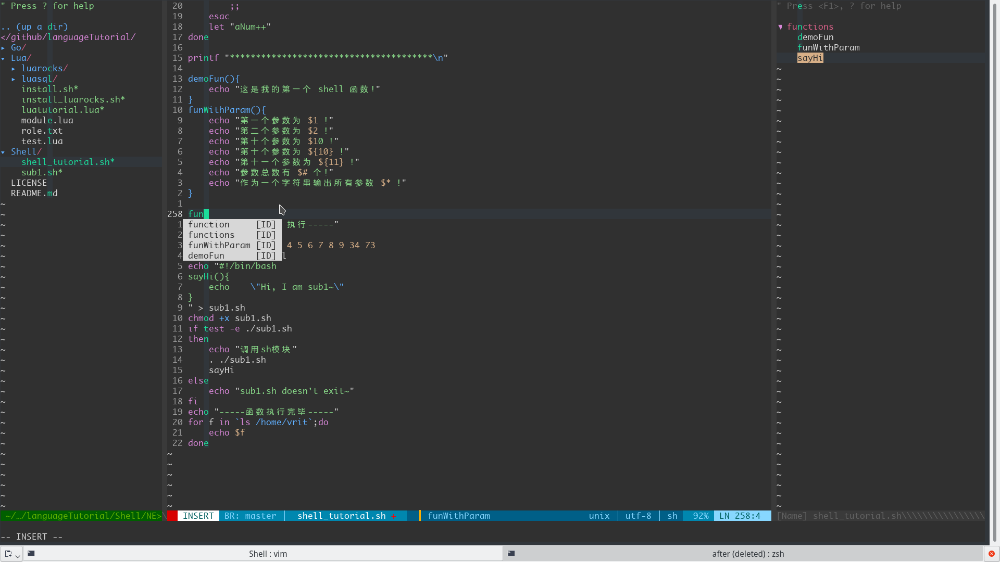
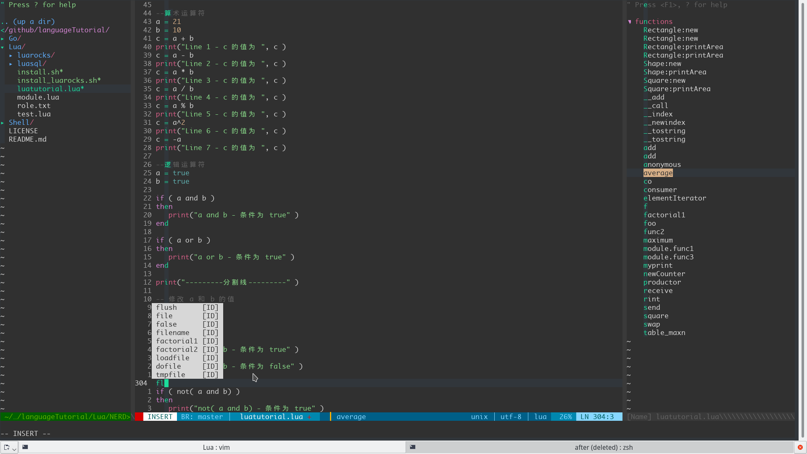

## 一份相对简单但是还能凑合用的VIM配置。
## master:
    Release: 0.100
## dev:
    Release 0.101 (add minimap)
#### 支持golang, python, c, c++, bash等,其中对golang,python支持最好，毕竟我还用着2333,后期想配成模块，能够用一个简单的匹配文件来打开/关闭某一语言的相关设置。欢迎star, 提issue, 一起改进ivim:)

安装脚本:
```
#!/bin/sh
mkdir ~/vim.bak
mv ~/.vim* ~/vim.bak
git clone http://github.com/vritxii/ivim.git ~/.vim
ln -s ~/.vim/vimrc ~/.vimrc
vim -c PluginInstall
#waiting...
```
尽情享受吧!

配置简易说明:
- 字体: monaco
- 配色: onehalfdark
- 自动补全: YouCompleteMe(YCM)
- 目录树: NerdTree
- 函数列表: tagbar
- 语言相关:
  - vim-go
  - python-mode
  - vim-ruby
  - html5
  - vim-flavored-markdown

比较有用的功能:
- 自动补全(没了自动补全感觉不会写代码了...)
- 函数，变量列表，快速跳转
- 文件目录窗口，便捷垂直，水平切分窗口，支持鼠标调整窗口大小,键绑定快速窗口跳转
- 相对行数，能让你快速跳转到当前页面任意行，打开标尺，用十字定位当前光标，并将当前行和列高亮为原谅绿:)
- 一键编译运行，仅支持单文件，目前支持,c,c++,java,bash,python,golang
- 新建文件添加对应代码头(文件名，作者，邮箱，创建时间等)
- python pep8标准检查,虚拟环境，代码折叠，快速搜索和替换（可指定范围)，markdown实时预览

库引用:
- colors,docs,Colors.md: https://github.com/rafi/awesome-vim-colorschemes
- bundle/Vundle.vim: https://github.com/VundleVim/Vundle.vim

下面随便截了几张图,不知道为什么总感觉这配色和字体搭配看着很舒服:)
- Welcome Page


- Minimap


- golang


- python


- cpp


- vimrc


- bash


- lua

