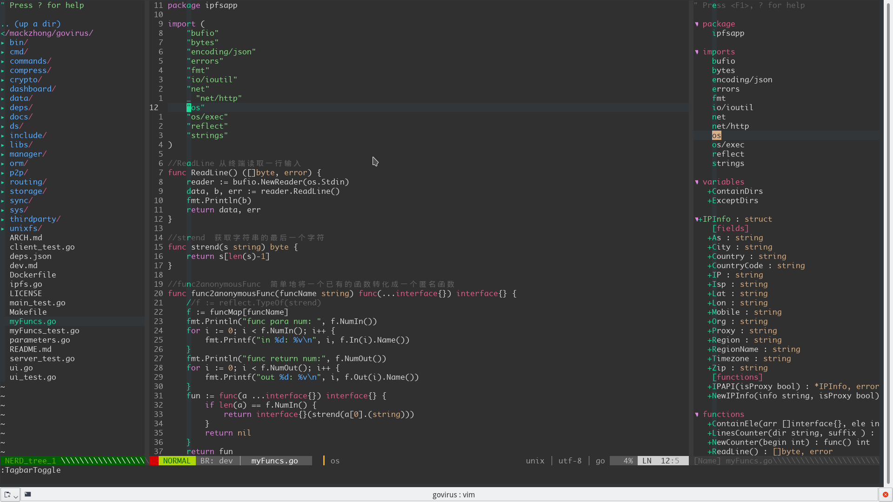

### An awesome vim config file.
#### For golang, python, cpp, lua, bash and so on.

Install Script:
```
#!/bin/sh
mkdir ~/vim.bak
mv ~/.vim* ~/vim.bak
git clone http://github.com/vritxii/ivim.git ~/.vim
ln -s ~/.vim/vimrc ~/.vimrc
vim -c PluginInstall
```
Enjoy it!
The font I used is monaco.
Here is a simple screenshot~

- golang


- python


- cpp


- vimrc


- bash


- lua

